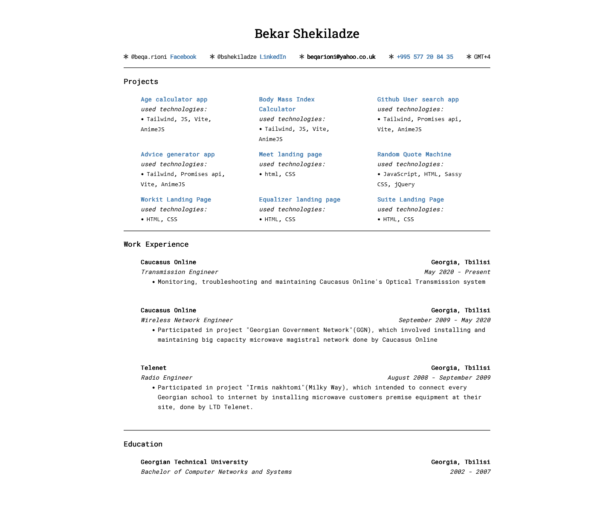
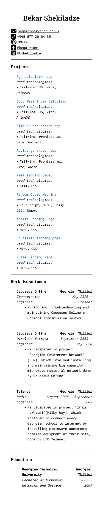

## About Me

I'm Bekar Shekiladze, a versatile engineer with a foundation in telecommunications and a burgeoning passion for web development. With a background in microware communications engineering and a Cisco CCENT certification, I've honed my skills in the world of wireless technology and networking.

### Telecommunications Journey

For over a decade, I've been an integral part of the telecommunications industry. I've contributed to projects like the "Georgian Government Network" (GGN) and "Irmis nakhtomi," which aimed to connect schools to the internet through advanced microwave technology. Currently, I work at Caucasus Online as a Transmission Engineer, where I monitor, troubleshoot, and maintain the Optical Transmission system.

### Venturing into Web Development

In parallel, I've been exploring the exciting world of web development. I've created web projects like:

- [Age Calculator App](https://age-calculator-app-beqarion.netlify.app/): An Age Calculator web application that allows users to input their birthdate and calculate their age. (Technologies: Tailwind CSS, JavaScript, Vite, AnimeJS)

- [BMI Calculator](https://bmi-calculator-fm.netlify.app/): A BMI Calculator web application that helps users determine their Body Mass Index and assess their health. (Technologies: Tailwind CSS, JavaScript, Vite, AnimeJS)

- [Github User Search App](https://github-user-search-app-beqarion.netlify.app/): A Github User Search application that lets users search for GitHub users and view their profiles. (Technologies: Tailwind CSS, Promises API, Vite, AnimeJS)

- [Advice Generator App](https://advice-generator-app-beqarion.netlify.app/): An Advice Generator web application that provides users with random pieces of advice. (Technologies: Tailwind CSS, Promises API, Vite, AnimeJS), and more. These projects showcase my proficiency in technologies like HTML, CSS, React, JavaScript, and more.

### Let's Connect

I'm always eager to learn, collaborate, and take on new challenges. Feel free to reach out to me via email at [beqarioni@yahoo.co.uk](mailto:beqarioni@yahoo.co.uk) or connect with me on [LinkedIn](https://www.linkedin.com/in/bshekiladze/) to discuss potential collaborations or opportunities.

**Please note**: While I have a good understanding of written and verbal English, my fluency may not be as high as the text you're currently reading, as I collaborated with ChatGPT to compose this README.

Thank you for visiting my resume website, and I look forward to connecting with you!

[Live website: https://beqarion.github.io/my-resume.github.io/](https://beqarion.github.io/my-resume.github.io/)

### Screenshots

**Desktop View**

**Mobile View**

